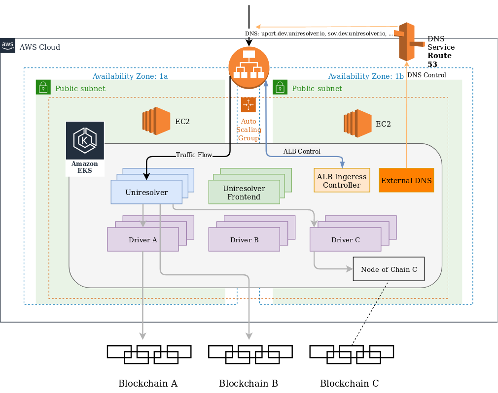

# Universal Resolver — Development System

The dev-system or the sandbox installation, which runs the latest code-base of the Universal Resolver project, is hosted at:

http://dev.uniresolver.io

The drivers are exposed by their subdomains (DID method-names). For example: btcr.dev.uniresolver.io 
> Note for driver-developers: The subdomains are automatically generated based on the Docker image tag e.g.: driver-did-btcr, which consequently must have the DID-method name as part of the tag-name (pattern:  driver-di-`<DID method name>`). 

DIDs can be resolved by calling the resolver:

http://dev.uniresolver.io/1.0/identifiers/did:btcr:xz35-jznz-q6mr-7q6

or by directly accessing the driver’s endpoint:

http://btcr.dev.uniresolver.io/1.0/identifiers/did:btcr:xz35-jznz-q6mr-7q6
 

The software is automatically updated on every commit and PR on the master branch. See [CI-CD](/docs/continuous-integration-and-delivery.md) for more details

Currently the system is deployed in the AWS cloud by the use of the Elastic Kubernetes Service (EKS). Please be aware that the use of AWS is not mandatory for hosting the resolver. Any environment that supports Docker Compose or Kubernetes will be capable of running an instance of the Universal Resolver.

## AWS Architecture
 
This picture illustrates the AWS architecture for hosting the Universal resolver as well as the traffic-flow through the system.

The entry-point to the system is the public Internet facing Application Load Balancer (ALB), that sits at the edge of the AWS cloud and is bound to the DNS name “dev.uniresolver.io”. When resolving DIDs the traffic flows through the ALB to the resolver. Based on the configuration of each DID-method the resolver calls the corresponding DID-driver (typical scenario) or may call another HTTP endpoint (another resolver or directly the DLT if HTTP is supported). In order to gain performance, blockchain nodes may also be added to the deployment, as sketched at Driver C.

The Kubernetes cluster is spanned across multiple Availability Zones (AZ), which are essential parts for providing fault-tolerance and achieving a high-availability HA of the system. This means that no downtime is to be expected in case of failing parts of the system, as the healthy parts will take over operations reliably.

If containers, like DID-Drivers, are added or removed, the ALB ingress controller https://kubernetes-sigs.github.io/aws-alb-ingress-controller/ takes care of notifying the ALB. Due to this mechanism the ALB stays aware of the system state and is able to keep traffic-routes healthy. 
By use of https://github.com/kubernetes-sigs/external-dns  the DNS Service Route 53 is updated. Further details regarding the automated system-update are described at [CI-CD](/docs/continuous-integration-and-delivery.md).

